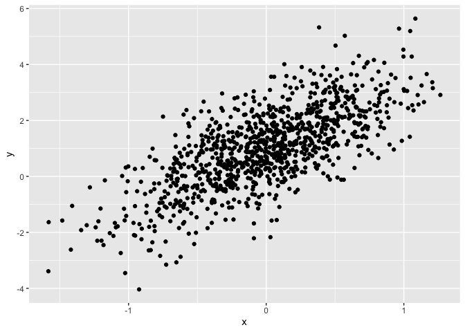
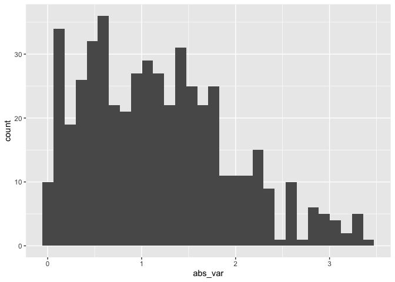
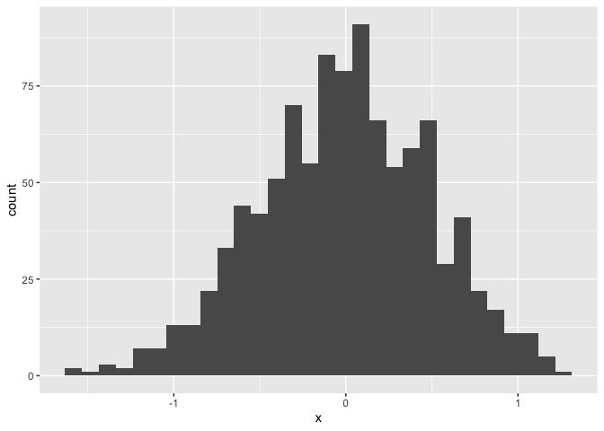

Simple document
================
Parker Chang

I’m an R Markdown document!

# Section 0

``` r
library(tidyverse)
```

“echo = F” makes code invisible “message = F” makes output invisible
“eval = F” makes code chunk not run

# Section 1

Here’s a **code chunk** that samples from a *normal distribution*:

``` r
samp = rnorm(100)
length(samp)
```

    ## [1] 100

# Section 2

I can take the mean of the sample, too! The mean is 0.248069.

# Section 3: a tibble

``` r
plot_df =
  tibble(
    x = rnorm(1000, sd = 0.5),
    y = 1 + 2 * x + rnorm(1000)
  )

head(plot_df)
```

    ## # A tibble: 6 × 2
    ##         x      y
    ##     <dbl>  <dbl>
    ## 1 -0.660   1.48 
    ## 2 -0.800   0.575
    ## 3 -1.18   -2.45 
    ## 4  0.728   2.33 
    ## 5 -0.839  -2.63 
    ## 6 -0.0870  2.69

# Section 4: plots

``` r
ggplot(plot_df, aes(x = x)) + geom_histogram()
```

    ## `stat_bin()` using `bins = 30`. Pick better value `binwidth`.

<!-- -->

``` r
ggplot(plot_df, aes(x = x, y = y)) + geom_point()
```

<!-- -->

# Section 5: Learning Assessment 2

Write a named code chunk that creates a dataframe comprised of: a
numeric variable containing a random sample of size 500 from a normal
variable with mean 1; a logical vector indicating whether each sampled
value is greater than zero; and a numeric vector containing the absolute
value of each element. Then, produce a histogram of the absolute value
variable just created. Add an inline summary giving the median value
rounded to two decimal places. What happens if you set eval = FALSE to
the code chunk? What about echo = FALSE?

This plot shows the distribution of the absolute value of
$X \sim N(1, 1)$.

``` r
la2_df =
  tibble(
    num_var = rnorm(n = 500, mean = 1),
    log_var = num_var > 0,
    abs_var = abs(num_var)
  )

ggplot(la2_df, aes(x = abs_var)) + geom_histogram()
```

    ## `stat_bin()` using `bins = 30`. Pick better value `binwidth`.

<!-- -->

The median is 1.08

# Section 6: Formatting

## Text formatting

*italic* or *italic* **bold** or **bold** `code` superscript<sup>2</sup>
and subscript<sub>2</sub>

## Headings

# 1st Level Header

## 2nd Level Header

### 3rd Level Header

## Lists

- Bulleted list item 1

- Item 2

  - Item 2a

  - Item 2b

1.  Numbered list item 1

2.  Item 2. The numbers are incremented automatically in the output.

## Tables

| First Header | Second Header |
|--------------|---------------|
| Content Cell | Content Cell  |
| Content Cell | Content Cell  |

# Section 7: Learning Assessment 3

After the previous code chunk, write a bullet list given the mean,
median, and standard deviation of the original random sample.

- The median is: 1.08.

- The mean is: 1.07.

- The standard deviation is: 0.92

# Adding Histogram

``` r
ggplot(plot_df, aes(x = x)) + geom_histogram()
```

    ## `stat_bin()` using `bins = 30`. Pick better value `binwidth`.

<!-- -->
